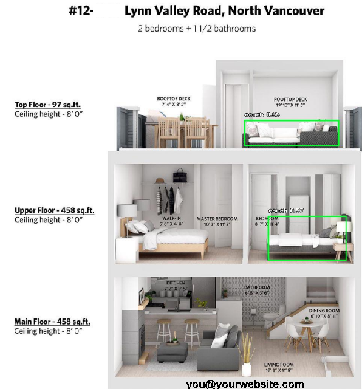

# Indoor Object Detection

In this project, the goal is to apply pretrained machine learning models on images taken from home/living spaces/indoor and try to detect the objects in the picture.

There is also a feature to extract the text (website, phone number, Address etc.) from the pictures as well.

Having these contexual information, the next step is to combine these raw information and image data  to infere a higher level knowledge out of the pictures.

## Models
 + Yolo
 + resnet
 + DenseNet

## Library
 + ML: Imageai's `ImagePrediction` and `ObjectDetection`
 + Text extraction: `pytesseract` and `cv2`

## Sample Extracted Text

`BzgkDahBHk3.jpg, [], [], ['[EM@eeee', 'you@yourwebsite.com'], #12-xxx Lynn Valley Road, North Vancouver||2 bedrooms + 11/2 bathrooms||ROOFTOP DECK ROOFTOP DECK|Top Floor - 97 sq.ft. 7`

